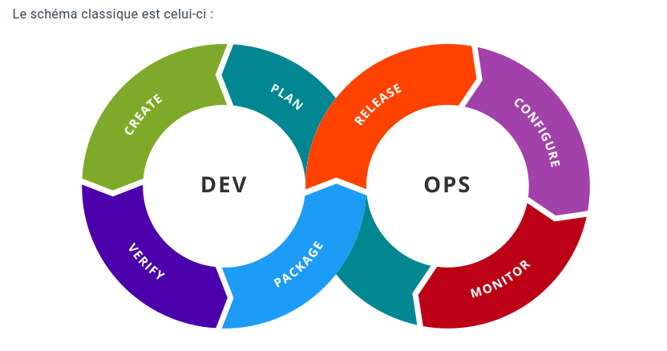

## **Qu'est-ce que le DevOps ?**

Le **DevOps** est une philosophie et un ensemble de pratiques visant à améliorer la collaboration entre le **développement logiciel** (Dev) et les **opérations informatiques** (Ops). Ce terme a été inventé en 2007 par Patrick Debois, un ingénieur belge.

---

### **Objectifs principaux du DevOps**

1. **Favoriser la collaboration :**
    - Supprimer les barrières entre les équipes de développement et d'exploitation.
2. **Améliorer la rapidité :**
    - Accélérer la livraison des logiciels grâce à l'automatisation et aux pipelines CI/CD.
3. **Augmenter la qualité :**
    - Intégration de tests automatisés et surveillance continue pour prévenir les erreurs en production.
4. **Améliorer la résilience :**
    - Monitoring proactif et feedback constant pour une amélioration continue.

---

### **Principes clés du DevOps**

1. **Intégration continue (CI) :**
    - Les développeurs intègrent fréquemment leur code dans un dépôt partagé, avec tests automatiques pour détecter rapidement les problèmes.
2. **Livraison continue (CD) :**
    - Les modifications validées sont automatiquement déployées dans des environnements intermédiaires ou de production.
3. **Infrastructure as Code (IaC) :**
    - Gestion de l'infrastructure via des fichiers de configuration, permettant une réplication et une mise à l'échelle rapides.
4. **Surveillance et journalisation :**
    - Analyse continue des performances des applications et des infrastructures pour détecter et corriger les anomalies.
5. **Culture de la rétroaction :**
    - Encouragement à collecter les retours d’expérience pour améliorer les processus.

---

### **Outils DevOps**

#### **1. Planification et collaboration**

- **Objectif :** Gestion des projets et suivi des tâches.
- **Outils principaux :**
  - GitLab
  - GitHub
  - Jira

#### **2. Gestion du code (Contrôle de version)**

- **Objectif :** Versionner le code pour faciliter la collaboration et éviter les conflits.
- **Outils principaux :**
  - GitHub
  - GitLab
  - Bitbucket

#### **3. Intégration continue / Déploiement continu (CI/CD)**

- **Objectif :** Automatiser le pipeline de développement (build, test, déploiement).
- **Outils principaux :**
  - Jenkins
  - GitLab CI/CD
  - GitHub Actions
  - CircleCI
  - Travis CI

#### **4. Gestion de l'infrastructure**

- **Objectif :** Automatiser la configuration et l'orchestration des serveurs et clusters.
- **Outils principaux :**
  - **Docker :** Conteneurisation des applications.
  - **Kubernetes :** Orchestration des conteneurs.
  - **Terraform :** Provisionnement d'infrastructure via IaC.
  - **Ansible :** Gestion de configuration des serveurs.

#### **5. Surveillance et retour d'information**

- **Objectif :** Suivre les performances et détecter les problèmes en temps réel.
- **Outils principaux :**
  - **Prometheus :** Monitoring des métriques.
  - **Grafana :** Visualisation des données et création de tableaux de bord.
  - **ELK Stack (Elasticsearch, Logstash, Kibana) :** Analyse et visualisation des logs.
  - **Autres :** Datadog, Nagios, New Relic, Sentry.

---

### **Schéma classique du DevOps**

---

### **Avantages du DevOps**

1. **Livraisons plus rapides :**
    - Réduction du temps entre le développement et le déploiement.
2. **Qualité logicielle accrue :**
    - Tests automatisés et intégration continue.
3. **Meilleure collaboration :**
    - Suppression des silos entre équipes Dev et Ops.
4. **Résilience améliorée :**
    - Détection et correction rapide des anomalies grâce à un monitoring en temps réel.
5. **Réduction des coûts :**
    - Automatisation des tâches répétitives et gestion simplifiée des infrastructures.

---

### **Résumé**

Le DevOps est une méthodologie moderne combinant outils, processus, et culture pour livrer des logiciels de manière rapide, fiable, et avec une meilleure qualité. En utilisant des outils comme **GitLab**, **Docker**, ou **Kubernetes**, et en adoptant des pratiques comme **CI/CD**, les entreprises peuvent améliorer la collaboration entre les équipes et répondre rapidement aux besoins du marché.
