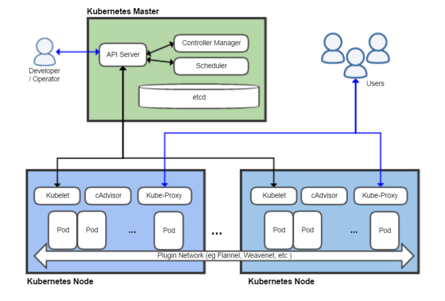
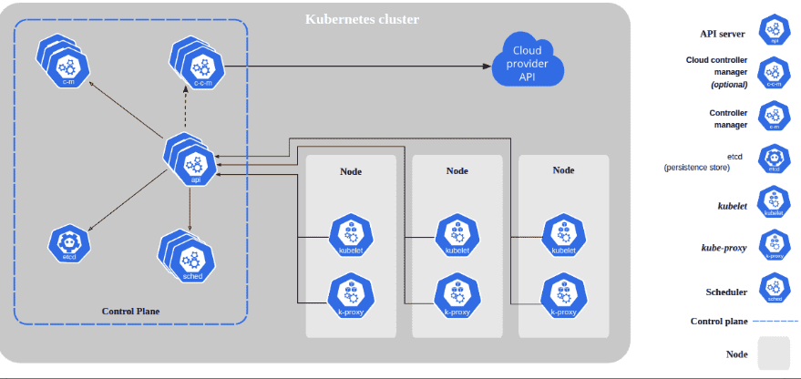

# **Architecture générale de Kubernetes**

Kubernetes est structuré autour d'un **cluster** composé de différents nœuds (_nodes_). Chaque nœud est une machine physique ou virtuelle sur laquelle les composants Kubernetes sont installés. Ces nœuds sont classés en deux types principaux :

- **Nœud de contrôle** (_Control Node_ ou _Control Plane_) :
    - Responsable de la gestion et de l'orchestration de l'ensemble du cluster.
    - Supervise les nœuds de travail.
    - Peut être déployé en une instance unique ou en plusieurs instances pour la haute disponibilité.

- **Nœuds de travail** (_Worker Nodes_) :
    - Hébergent les **Pods**, qui sont les unités de base dans Kubernetes. Chaque Pod contient un ou plusieurs conteneurs.
    - Gèrent l'exécution des applications.

(Schéma représentant l'architecture d’un cluster Kubernetes.)

---

### **Composants de Kubernetes**

La plateforme est divisée en deux grandes catégories de composants : **les composants de contrôle** (pour la gestion du cluster) et **les composants des nœuds de travail** (pour exécuter les applications).

---

#### **Composants du plan de contrôle (Control Plane)**

1. **kube-apiserver**
    - Le point d'entrée pour interagir avec Kubernetes.
    - Expose l'API REST utilisée par les administrateurs, les outils d'automatisation et d'autres composants Kubernetes.
2. **etcd**
    - Base de données clé-valeur distribuée et résiliente.
    - Stocke toutes les données de configuration et l'état du cluster.
    - Élément critique pour le fonctionnement du cluster.
3. **kube-scheduler**
    - Composant chargé d'assigner les Pods à des nœuds de travail.
    - Prend des décisions basées sur des critères comme la capacité des nœuds, les contraintes de ressources ou l'affinité de déploiement.
4. **kube-controller-manager**
    - Composant regroupant plusieurs **contrôleurs**, chacun étant responsable d’un aspect spécifique du cluster.
        - **Node Controller** : Supervise la disponibilité des nœuds et réagit en cas de panne.
        - **Replication Controller** : Maintient le nombre souhaité de Pods en cours d'exécution.
        - **Endpoints Controller** : Lie les services aux Pods correspondants.
        - **Service Account & Token Controllers** : Crée des comptes par défaut et des jetons pour les namespaces.
5. **cloud-controller-manager** (optionnel, utilisé pour les clusters déployés sur un cloud) :
    - Interagit avec l'API du fournisseur cloud pour gérer les ressources externes.
    - Exemple de contrôleurs spécifiques au cloud :
        - **Node Controller** : Vérifie si un nœud supprimé dans le cloud est bien retiré du cluster.
        - **Route Controller** : Configure les routes réseau sur le cloud.
        - **Service Controller** : Gère les équilibreurs de charge.
        - **Volume Controller** : Administre les volumes de stockage.

---

#### **Composants des nœuds de travail**

Ces composants s'exécutent sur chaque nœud de travail pour maintenir l'exécution des Pods et permettre leur communication réseau.

1. **kubelet** :
    - Agent principal exécuté sur chaque nœud.
    - S'assure que les conteneurs dans les Pods sont démarrés, sains et conformes aux spécifications.
2. **kube-proxy** :
    - Gère les règles réseau sur chaque nœud.
    - Assure la communication entre les Pods et avec les clients externes via des proxys et des routages dynamiques.
3. **Runtime des conteneurs** (_Container Runtime_) :
    - Moteur responsable de l'exécution des conteneurs.
    - Exemples : Docker (anciennement utilisé), **containerd**, **CRI-O**.

(Schéma des composants Kubernetes dans un cluster.)

---

### **Résumé des rôles des composants**

| **Composant** | **Rôle principal** |
| - | - |
| kube-apiserver           | Point d'entrée API pour l'administration et l'interaction avec Kubernetes.                 |
| etcd                     | Stocke l'état et la configuration du cluster.                                              |
| kube-scheduler           | Planifie les Pods sur les nœuds disponibles.                                               |
| kube-controller-manager  | Supervise et maintient les différents aspects du cluster (nœuds, Pods, services, comptes). |
| cloud-controller-manager | Gère l'intégration avec les fournisseurs de cloud (pour les clusters cloud).               |
| kubelet                  | Assure l'exécution et la santé des Pods sur les nœuds.                                     |
| kube-proxy               | Gère la connectivité réseau et la répartition de charge entre Pods et services.            |
| Runtime des conteneurs   | Exécute les conteneurs dans les Pods (par exemple : containerd, CRI-O).                    |

---

**En bref**, l’architecture de Kubernetes est conçue pour être modulaire, résiliente et adaptée aux environnements distribués. Chaque composant joue un rôle essentiel pour garantir que les applications s'exécutent de manière fiable, même à grande échelle.
