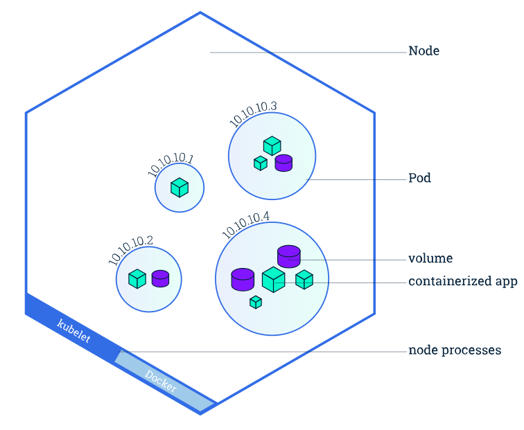

---
tags:
  - Principaux_Objet/Introduction_Pods
---
***

#### **Que sont les Pods ?**

Les **Pods** sont les plus petites unités déployables dans Kubernetes. Ils représentent un **groupe de conteneurs**, avec un stockage partagé, une identité réseau commune, et une spécification définissant comment les conteneurs doivent être exécutés.

- **Origine du terme "Pod"** :
    - Inspiré de _pod of whales_ (banc de baleines) ou _pea pod_ (gousse de pois), reflétant la dépendance et la proximité des conteneurs dans un Pod.
- **Caractéristiques principales :**
    - Un Pod peut contenir **un ou plusieurs conteneurs** étroitement couplés (cas rare).
    - Il partage des ressources comme :
        - **Volumes** pour le stockage.
        - **Adresse IP** et ports réseau.

---

#### **Structure et schéma des Pods**

- Chaque Pod s'exécute sur un **nœud de travail**. Un nœud peut héberger plusieurs Pods.
- Les conteneurs au sein d’un Pod peuvent partager :
    - **Volumes** : pour un stockage commun.
    - **Ressources réseau** : comme une adresse IP partagée.

---

#### **Utilisation des Pods**

1. **Pod à conteneur unique (le cas le plus courant)** :
    
    - Chaque Pod encapsule un seul conteneur.
    - Kubernetes gère les Pods directement, et non les conteneurs.
2. **Pod multi-conteneurs (cas rare)** :
    
    - Plusieurs conteneurs sont colocalisés dans un Pod et partagent des ressources.
    - Exemples d’usage :
        - Un conteneur sert des données stockées dans un volume.
        - Un autre conteneur met à jour ou rafraîchit ces données.
3. **Scalabilité et réplication :**
    
    - Un Pod est conçu pour exécuter **une seule instance** d'une application.
    - Pour augmenter les ressources disponibles (scalabilité horizontale), il faut déployer plusieurs Pods (réplication).

---

#### **Créer un premier Pod**

##### **Exemple : Création d’un Pod Nginx**

1. **Fichier YAML pour le Pod :**  
    Créez un fichier nommé `premier-pod.yaml` :
    
    yaml
    
    Copier le code
    
    apiVersion: v1
	kind: Pod
	metadata:
	  name: nginx
	spec:
	  containers:
	  \- name: nginx
    image: nginx:alpine
    ports:
    \- containerPort: 80
    
2. **Créer le Pod avec kubectl :**
    
    bash
    
    `kubectl apply -f premier-pod.yaml`
    
    Résultat :
    
    plaintext
    
    `pod/nginx created`
    
3. **Vérifier le statut du Pod :**
    
    bash
    
    `kubectl get pods`
    
    Exemple de sortie initiale :
    
    plaintext
    
    `NAME    READY   STATUS              RESTARTS   AGE nginx   0/1     ContainerCreating   0          3s`
    
    Après quelques instants :
    
    plaintext
    
    `NAME    READY   STATUS    RESTARTS   AGE nginx   1/1     Running   0          5m`
    
    **Champs de la commande `kubectl get pods` :**
    
    - **NAME** : Nom du Pod (issu de `metadata > name`).
    - **READY** : Nombre de conteneurs prêts dans le Pod (par exemple, `1/1`).
    - **STATUS** : État actuel du Pod (`ContainerCreating`, `Running`, etc.).
    - **RESTARTS** : Nombre de redémarrages des conteneurs.
    - **AGE** : Temps écoulé depuis la création du Pod.
4. **Supprimer le Pod :**
    
    bash
    
    `kubectl delete pod nginx`
    
    Résultat :
    
    plaintext
    
    `pod "nginx" deleted`
    

---

#### **Remarques importantes sur les Pods**

- **Redémarrage :**
    
    - Un **conteneur** dans un Pod peut redémarrer, mais le Pod lui-même persiste jusqu'à sa suppression explicite.
    - Un Pod est un **environnement d’exécution**, pas un processus.
- **Création des Pods :**
    
    - Dans la majorité des cas, les Pods ne sont pas créés directement. Ils sont générés via des objets comme :
        - **Deployments** (gestion de réplicas et mises à jour).
        - **StatefulSets** (gestion des applications avec état).
        - **DaemonSets** (déploiement sur tous les nœuds).
        - **Jobs** et **CronJobs** (tâches ponctuelles ou planifiées).

---

#### **Résumé**

- Les Pods sont la **brique de base déployable** dans Kubernetes.
- Ils encapsulent un ou plusieurs conteneurs et partagent des ressources comme des volumes et des adresses réseau.
- Bien que des Pods puissent être créés directement, il est préférable d’utiliser des objets de gestion comme **Deployments** ou **StatefulSets** pour des besoins complexes.

Les Pods seront approfondis au fur et à mesure de la formation pour aborder des cas plus complexes et des configurations avancées.